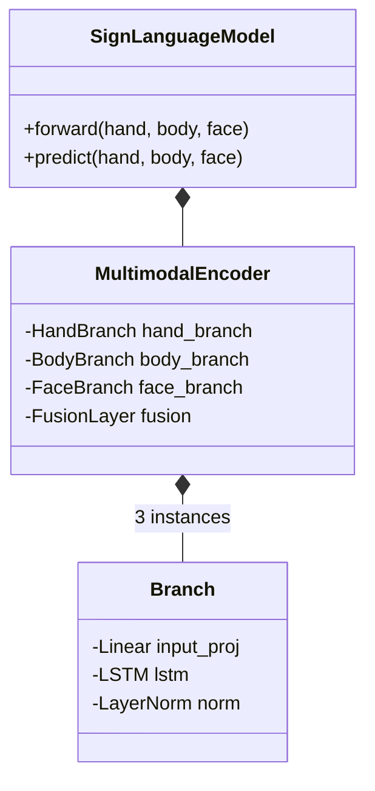

# Módulo de Inferencia (Inference Layer)


> **Responsabilidad**: Cargar el modelo de deep learning, gestionar los tensores y ejecutar la inferencia pura (logits/probabilidades).

El módulo `inference` encapsula toda la lógica relacionada con PyTorch. No tiene conocimiento del negocio ni de la semántica de las señas, solo opera con tensores y IDs de clase numéricos.

## 🏗️ Arquitectura del Modelo

El núcleo es una red neuronal LSTM multimodal (`SignLanguageModel`) diseñada para procesar secuencias temporales de keypoints.



### Componentes de la Red
1. **Ramas Independientes**:
   - `HandBranch`: Procesa 2 manos x 21 puntos (168 dims).
   - `BodyBranch`: Procesa pose corporal (132 dims).
   - `FaceBranch`: Procesa gestos faciales (1872 dims → reducido).
2. **Fusión**: Concatena embeddings de las 3 ramas.
3. **Clasificador**: Capa lineal final que proyecta a `num_classes` logits.

---

## 🛠️ Componentes Principales

### 1. `InferenceLoader`
Responsable de cargar el checkpoint `.pt` y su configuración asociada.

```python
loader = InferenceLoader(
    checkpoint_path="models/best.pt",
    class_mapping_path="models/class_mapping.json",
    device="cpu"
)
model = loader.load_model()
```
- **Manejo de estados**: Verifica que el checkpoint sea compatible con la arquitectura actual.
- **Configuración dinámica**: Infiere dimensiones de entrada y número de clases desde el archivo.

### 2. `Predictor`
Wrapper de alto nivel para facilitar la inferencia.

```python
predictor = Predictor(model, class_names, device="cpu")
result = predictor.predict_from_features({
    "hand": tensor_hand, # [B, T, 168]
    "body": tensor_body, # [B, T, 132]
    "face": tensor_face  # [B, T, 1872]
})
```
- **Entrada**: Diccionario de tensores (hand, body, face).
- **Salida**: Objeto `PredictionResult` con Top-1 y Top-K.
- **Normalización**: Asegura que los tensores estén en el dispositivo correcto y con tipos de dato adecuados (`float32`).

### 3. Tipos de Datos (`model.py` / `predictor.py`)

| Clase | Descripción |
|-------|-------------|
| `SignLanguageClassifier` | Implementación PyTorch (`nn.Module`) del modelo. |
| `PredictionResult` | Dataclass con `top1_class_id`, `top1_score`, `topk`. |
| `TopKPrediction` | Detalle de una predicción en la lista Top-K. |
| `ModelInfo` | Metadatos extraídos del checkpoint (epoch, loss, etc.). |

---

## 🔄 Flujo de Datos

1. **Entrada**: Tensores crudos normalizados desde `services`.
2. **Forward Pass**:
   - Proyección lineal + ReLU
   - LSTM (captura dependencias temporales)
   - LayerNorm
   - Fusión de modalidades
   - Pooling temporal (Mean Pooling)
   - Clasificador lineal
3. **Salida**: Logits.
4. **Post-proceso**: Softmax para obtener probabilidades y selección de Top-K índices.
